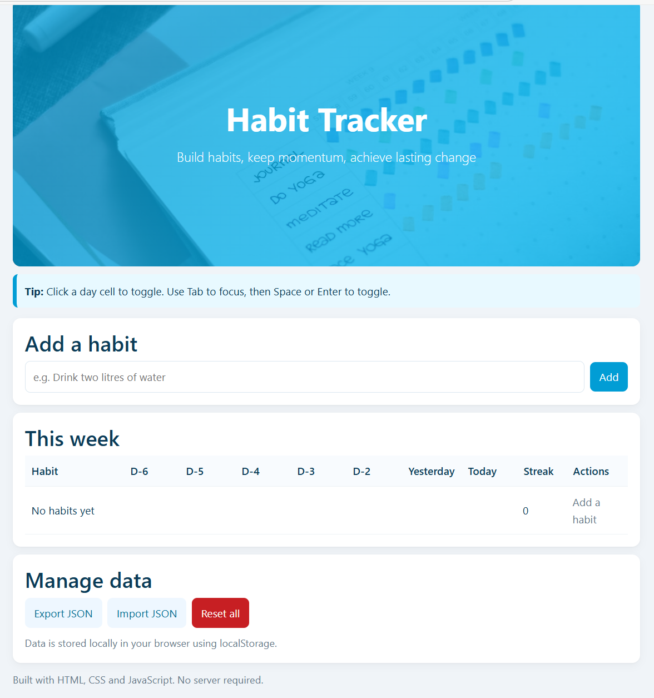
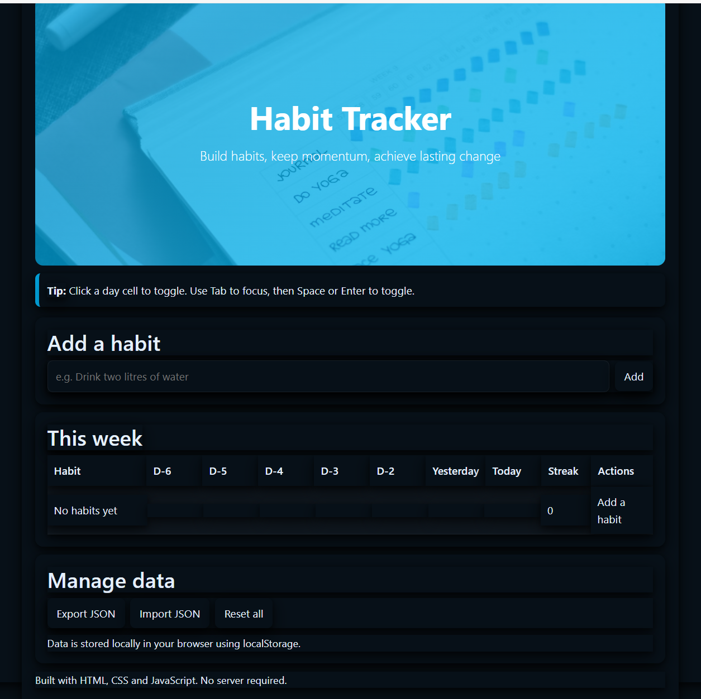
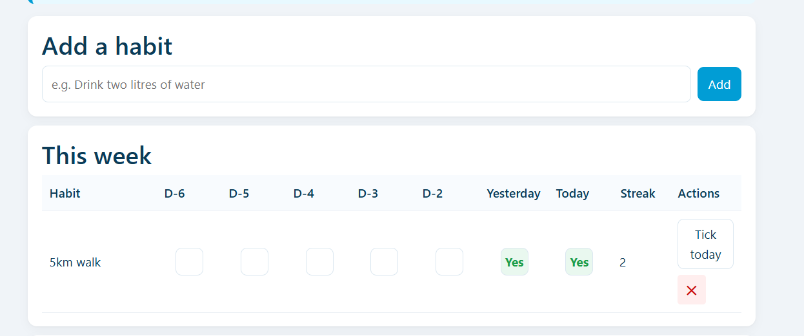

# 🎯 Habit Tracker

## Description

A lightweight, browser-based habit tracking application built with vanilla JavaScript, HTML, and CSS. This project was created as part of the Dynamic Web Applications with JavaScript course at Laurea UAS. The app allows users to track daily habits across a weekly view, monitor streaks, and manage their data locally without requiring a server.

## Key Features

- ✨ **Add and Track Habits** — Create custom habits and mark them complete for each day of the week
- 📊 **Streak Counter** — Automatically calculates and displays your current streak for each habit
- 💾 **Local Storage** — All data persists in your browser using localStorage
- 📤 **Export/Import** — Backup and restore your habits as JSON files
- ♿ **Accessibility** — Full keyboard navigation support with ARIA attributes for screen readers
- 🌓 **Dark Mode** — Toggle between light and dark themes using Bootstrap's color mode system
- 📱 **Responsive Design** — Works across desktop and mobile devices

## Live Demo

- **Live App**: 
- **Repository**: 

---

## How to Run Locally

### Prerequisites

- A modern web browser (Chrome, Firefox, Safari, or Edge)
- (Optional) Visual Studio Code with Live Server extension

### Option 1: Direct File Opening

1. **Download the project:**
   - Go to 
   - Click the green **Code** button → **Download ZIP**
   - Extract the ZIP file to a folder on your computer

2. **Open the app:**
   - Navigate to the extracted folder
   - Double-click `index.html` to open it in your default browser

### Option 2: Using Git and Live Server (Recommended)

**Windows:**
```powershell
# Clone the repository
git clone https://github.com/LawinKh/habit-tracker.git

# Navigate to the project folder
cd habit-tracker

# Open in VS Code
code .
```

3. **Launch with Live Server:**
   - Install the **Live Server** extension in VS Code (if not already installed)
   - Right-click on `index.html` → Select **Open with Live Server**
   - The app will open automatically in your browser at `http://127.0.0.1:5500`

---

## Screenshots

### Light Mode


### Dark Mode


### Weekly View with Streaks


---

## Self-Assessment (Canvas Rubric)

### Core Functionality (7/10)

The app successfully implements all core features: adding habits, toggling completion for each day, calculating streaks, and managing data through export/import/reset functions. Users can interact with the app without encountering critical errors. However, input validation could be stronger—while empty inputs are blocked, the app doesn't prevent special characters or excessively long habit names. Additionally, the dark mode implementation, while functional, could benefit from more refined color contrast and consistency across all UI elements.

### Code Quality and Architecture (4/5)

The codebase is organized with clear separation between HTML structure, CSS styling, and JavaScript logic. Functions are reasonably focused and named descriptively (e.g., `computeStreak`, `toggleLog`, `render`). Comments explain key sections, though some could be more concise. The use of a single `state` object and a `render()` function creates a predictable data flow. Minor improvements could include extracting repeated inline styles into CSS classes and consolidating some of the dark mode CSS rules for better maintainability.

### UX and Accessibility (3/5)

The app includes semantic HTML (`<header>`, `<section>`, `<main>`), ARIA attributes (`role="checkbox"`, `aria-checked`, `aria-labelledby`), and keyboard navigation support. Focus indicators are visible, and the interface is generally intuitive. However, dark mode text contrast could be improved in certain areas (particularly the grid header and muted text), and the jumbotron image visibility in dark mode required additional CSS fixes. The layout is responsive on most devices, though some elements could be better optimized for very small screens.

### Data Handling and Persistence (3/4)

The app correctly reads from and writes to localStorage, and the import function includes basic JSON validation with try-catch error handling. Data persists across browser sessions reliably. However, there's no validation for corrupted localStorage data on initial load, and the app doesn't sanitize user input before inserting it into the DOM, which could pose minor security risks (though the practical impact is low for a client-side-only app).

### Documentation (3/3)

The README includes a clear project description, a comprehensive feature list, step-by-step installation instructions for both Windows and macOS, links to the live demo and repository, and this self-assessment section. Screenshots illustrate the app's functionality. The reflection section provides honest insights into the learning process and areas for improvement.

### Deployment (2/3)

The app is successfully deployed on GitHub Pages and accessible via the provided link. The deployment process was straightforward, and the live version functions identically to the local version. While the basic deployment is complete, no additional release management or CI/CD practices were implemented.

### Demo Video and Project Documentation (5/5)

*(To be completed upon video submission)*

### **Total Estimated Score: 27/35**

---

## Learning Reflection (250 words)

This project was an invaluable hands-on experience in building a complete front-end application using vanilla JavaScript. The most significant learning came from hand coding or writing the code from scratch which helped me learn better JavaScript, debug and overall exercise patience in the process. I also gained practical experience with the localStorage. It is the first time I worked with JavaScript for creating export and import of JSON files.

Accessibility was a key focus, and I learned how to use ARIA attributes effectively, implement keyboard navigation, and ensure that screen readers could interpret the app correctly. However, I recognize that my dark mode implementation needs improvement. While functional, the color contrast ratios and consistency across elements could be refined to meet standards better. This is an area I plan to study more deeply. Another challenge I faced was overriding light mode stylings, but I managed to work it using the !important rule.

The biggest challenge was debugging some of my hand-typed errors, typos in variable names, or misplaced brackets etc. Using the browser's DevTools Console became an essential skill, and I learned to read error messages more effectively.

Moving forward, I want to deepen my understanding of accessibility best practices, particularly around color contrast and focus management. I also aim to solidify my JavaScript knowledge by building more complex projects and exploring modern frameworks to see how the patterns I learned here translate to larger-scale applications. Overall, this project gave me confidence in my ability to build functional, user-friendly web applications from scratch.

---

## Technologies Used

- **HTML5** — Semantic structure and accessibility
- **CSS3** — Custom styling and responsive design
- **JavaScript (ES6+)** — Application logic and DOM manipulation
- **Bootstrap 5** — Dark mode toggle component
- **localStorage API** — Client-side data persistence
- **GitHub Pages** — Static site hosting

---

## Future Improvements

- 🎨 Refine dark mode with better color contrast and WCAG compliance
- 📱 Improve mobile responsiveness for very small screens
- 🔍 Implement search/filter functionality for large habit lists
- 🌍 Add multi-language support
- 📈 Include data visualization (charts showing progress over time)

---

## License

This project is open source and available under the [MIT License](LICENSE).

---

## Author

**Lawin Khalil**  
Laurea University of Applied Sciences  
Dynamic Web Applications with JavaScript — TO00BL10

---

## Acknowledgments

- Bootstrap dark mode and colors implementation based on official Bootstrap documentation
- Background image from Unsplash

## Screenshots 

